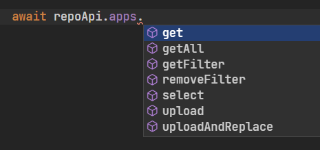
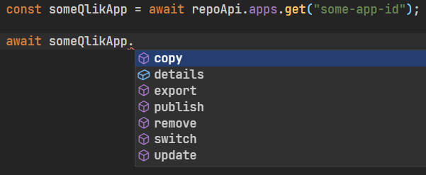
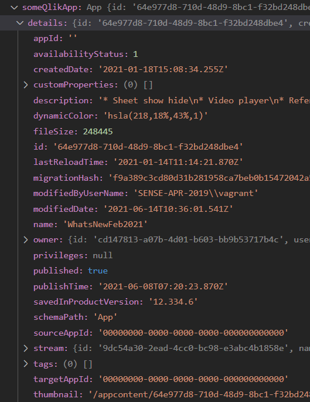
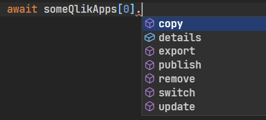

## **UNDER DEVELOPMENT!**

## Compatibility

At the moment the module is compatible with `QSEoW` version `May 2021`

---

**NOT AFFILIATED WITH QLIK**

---

## Methods

Full list of available methods can be found [here](https://informatiqal.github.io/qlik-repo-api/classes/QlikRepoApi.html)

## Generic clients

The package expose two extra (generic) methods. These methods are not "bound" to specific method/object (aka raw methods). These methods can be used in the cases where this package is not handling some specific endpoint. For them the `url` and `body` (for `Post` and `Put` methods) must be provided.

- `repoClient` - client that uses `/qrs` as prefix. The required `url` should be passed without the `/qrs` prefix
- `genericClient` - client that have no prefix. Useful for downloading temporary files (but not only)

## General usage

The package expose few logical methods. For example: `apps`, `streams`, `users` etc. Each of these methods:

- have `get` method that returns instance of the returned object
- multiple methods that operates on multiple objects.

The `get` method will then have methods that are operating on the single returned object.

**For example:**

The `apps` method will expose the following methods:


If we use the `get` method then the result variable will have additional methods:


All these methods (`copy`, `export`, `publish` etc.) will be executed in the context of the app id provided in the `get` method (`some-app-id`)

`details` property will contain all the meta data for the app:



The other methods (apart from `get`) might return array of object instances. For example `apps.getFilter` method will return an array of app instances:

```javascript
const someQlikApps = await repoApi.apps.getFilter("name sw 'License Monitor'");
```

The `someQlikApps` variable will be an array of the `App` class. Each element of array will have `details` and the single app methods




## Usage examples

### Update app

For a single app: change the name, add custom properties and tags

```javascript
const someQlikApp = await repoApi.apps.get("some-app-id");

console.log(someQlikApp.details.name);

const updateResponse = await someQlikApp.update({
  name: "new app name",
  tags: ["tag-name-1", "tag-name-2"],
  customProperties: [
    "customProperty1=value1",
    "customProperty1=value2",
    "customProperty2=some-value",
  ],
});
```

### Update multiple apps

For a single app: change the name, add custom properties and tags

```javascript
// all apps with their name is starting with "License"
const licenseMonitorApps = await repoApi.apps.getFilter("name sw 'License'");

// update each app by adding custom properties
const updateResults = await Promise.all(
  licenseMonitorApps.map((app) =>
    app.update({
      customProperties: [
        "customProperty1=value1",
        "customProperty1=value2",
        "customProperty2=some-value",
      ],
    })
  )
);
```

Once all apps are updated the `updateResults` variable will be:

```javascript
[
  { id: "app-id-1", status: 200 },
  { id: "app-id-2", status: 200 },
  { id: "app-id-3", status: 200 },
  ...
]
```

As a "side effect" details for each app in `licenseMonitorApps` will also be updated in the variable and there is no need to call `getFilter` to retrieve the updated information.

More examples will be added in the `Examples` folder
