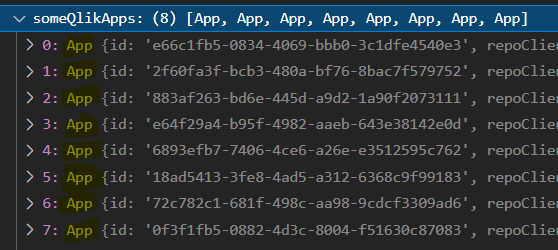

# Qlik Sense Repo API (Beta)

[](https://ko-fi.com/T6T0148ZP)

Node.js/browser package to interact with Qlik Sense Repository API (QSEoW)

## NOT AFFILIATED WITH QLIK

## Please check out the [Wiki section](https://github.com/Informatiqal/qlik-repo-api/wiki) for details and examples

## Installation

`npm install qlik-repo-api`

> **Note**
> Node version >= 16.0.0

## Authentication

The package itself will **NOT** perform authentication. All authentication information is passed in the config (see next section).

But multiple authentication configuration can be provided:

- certificates
- JWT
- header
- session
- ticket

## Initialization

- JWT

  ```javascript
  const repoApi = new QlikRepoApi.client({
    host: "my-sense-server.com",
    proxy: "virtualProxyPrefix", // optional
    authentication: {
      token: "eyJhbGciOiJSUzI1NiIsInR5cCI6IkpXVCJ9...",
    },
  });
  ```

- Certificates

  ```javascript
  const https = require("https");
  const fs = require("fs");

  // read the certificate files
  const cert = fs.readFileSync(`/path/to/client.pem`);
  const key = fs.readFileSync(`/path/to/client_key.pem`);

  // create httpsAgent. Pass the certificate files and ignore any certificate errors (like self-signed certificates)
  const httpsAgentCert = new https.Agent({
    rejectUnauthorized: false,
    cert: cert,
    key: key,
  });

  // the actual initialization
  const repoApi = new QlikRepoApi.client({
    host: "my-sense-server.com",
    port: 4242, // optional. default 4242
    httpsAgent: httpsAgentCert,
    authentication: {
      user_dir: "USER-DIRECTORY",
      user_name: "userId",
    },
  });
  ```

- Header

  ```javascript
  const https = require("https");

  // httpsAgent (Node.js only) can be used with other authentication methods to ignore certificate errors (if any)
  const httpsAgentIgnoreSelfSigned = new https.Agent({
    rejectUnauthorized: false,
  });

  // the actual initialization
  const repoApi = new QlikRepoApi.client({
    host: "my-sense-server.com",
    proxy: "virtualProxyPrefix",
    httpsAgent: httpsAgentIgnoreSelfSigned,
    authentication: {
      header: "SomeHeader",
      user: "USER-DIRECTORY\\userId",
    },
  });
  ```

## Browser usage

Although interacting with `Qlik Repository API` is mainly for automation and administration purposes (backend/server-to-server) this package can be used in browser environment as well.

There are couple of limitations in this case and they are both because of `https` package not being available in the browser. For this reason `certificate` config authentication can't be used and any certificate issues can't be ignored (`rejectUnauthorized: false`).

## Methods

Full list of available methods can be found [here](https://informatiqal.github.io/qlik-repo-api/modules.html)

## Generic clients

The package expose two extra (generic) methods. These methods are not "bound" to specific method/object (aka raw methods). These methods can be used in the cases where this package is not handling some specific endpoint. For them the `url` and `body` (for `Post` and `Put` methods) must be provided.

- `repoClient` - client that uses `/qrs` as prefix. The required `url` should be passed without the `/qrs` prefix
- `genericClient` - client that have no prefix. Useful for downloading temporary files (but not only)

## General usage

The package expose few logical methods. For example: `apps`, `streams`, `users` etc. Each of these methods:

- have `get` method that returns instance of the returned object
- multiple methods that operates on multiple objects.

The `get` method will then have methods that are operating on the single returned object.

**For example:**

The `apps` method will expose the following methods:


If we use the `get` method then the result variable will have additional methods:


All these methods (`copy`, `export`, `publish` etc.) will be executed in the context of the app id provided in the `get` method (`some-app-id`)

`details` property will contain all the meta data for the app:


The other methods (apart from `get`) might return array of object instances. For example `apps.getFilter` method will return an array of app instances:

```javascript
const someQlikApps = await repoApi.apps.getFilter({
  filter: "name sw 'License Monitor'",
});
```

The `someQlikApps` variable will be an array of the `App` class. Each element of array will have `details` and the single app methods




## Usage examples

### Update app

For a single app: change the name, add custom properties and tags

```javascript
const someQlikApp = await repoApi.apps.get({ id: "some-app-id" });

console.log(someQlikApp.details.name);

const updateResponse = await someQlikApp.update({
  name: "new app name",
  tags: ["tag-name-1", "tag-name-2"],
  customProperties: [
    "customProperty1=value1",
    "customProperty1=value2",
    "customProperty2=some-value",
  ],
});
```

### Update multiple apps

For a single app: change the name, add custom properties and tags

```javascript
// all apps with their name is starting with "License"
const licenseMonitorApps = await repoApi.apps.getFilter({
  filter: "name sw 'License'",
});

// update each app by adding custom properties
const updateResults = await Promise.all(
  licenseMonitorApps.map((app) =>
    app.update({
      customProperties: [
        "customProperty1=value1",
        "customProperty1=value2",
        "customProperty2=some-value",
      ],
    })
  )
);
```

Once all apps are updated the `updateResults` variable will be:

```javascript
[
  { id: "app-id-1", status: 200 },
  { id: "app-id-2", status: 200 },
  { id: "app-id-3", status: 200 }
  ...
]
```

As a "side effect" details for each app in `licenseMonitorApps` will also be updated in the variable and there is no need to call `getFilter` to retrieve the updated information.

More examples to follow
